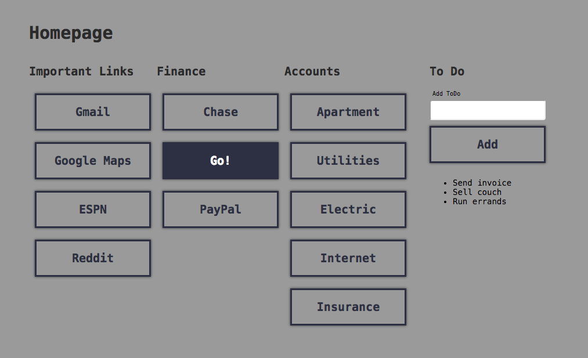

# HomePage

A modern and minimalist static homepage

## How to Use
Setup links array in `js/links.js`
to have the following structure for its objects.

Type can only be:
 * IMPORTANT
 * FINANCE
 * ACCOUNTS

`{
     "type": "IMPORTANT",
     "link": "https://google.com",
     "text": "Google"
}`

SCSS is incorporated in project, please see `scss/style.scss`.

See below for cli usage.

## Install Dependencies

`npm install`

## Run

`npm start`

## Compile SCSS

`npm run scss`

## Compile SCSS watch

`npm run scss-watch`